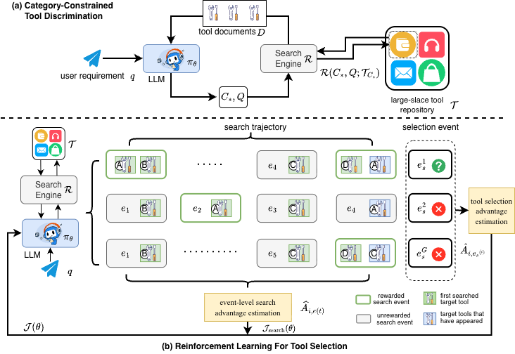

# ToolSearcher: Optimizing Tool Selection at Scale via Reinforcement Learning

## Overview of ToolSearcher
a novel RL approach named ToolSearcher, which is designed to enable effective multi-turn search and fine-grained optimization for large-scale tool selection. 
To differentiate between functionally similar tools, we propose category-constrained tool discrimination, which creates a highly constrained challenge environment designed to enhance LLMs’ ability to understand and distinguish tool functionalities.
To explicitly model the tool search process, we propose event-level search modeling, which optimizes the search by concentrating on events that discover previously unsearched target tools, thereby enhancing the LLM's ability to plan and search for compatible tool compositions.
To facilitate the joint learning of multiple capabilities in tool selection, we design trajectory-aligned credit allocation, a fine-grained reward mechanism that assigns objective and quantifiable credit based on each sample’s progression within the search-selection trajectory. 
Unlike outcome-only rewards, this method evaluates samples at different stages, providing matched feedback that accurately reflects their progress for tool selection.



Overview of ToolSearcher. (a) Illustration of the category-constrained tool discrimination. (b) Illustration of RL for tool selection that contains event-level search modeling and trajectory-aligned credit allocation.

## Environment install
### Environment for training
```bash
conda create -n verl python==3.10
git checkout v0.5.0
pip install -e .
pip install vllm==0.8.2
pip install tensordict==0.6.2
pip install "sglang[all]==0.4.6.post5"
#pip install "sglang[all]>=0.4.5.post3"
pip install torch==2.6.0 torchaudio==2.6.0 torchvision==0.21.0
pip install ray==2.44.0
pip install ransformers==4.52.4
pip install /XXX/flash_attn-2.6.3+cu123torch2.4cxx11abiFALSE-cp310-cp310-linux_x86_64.whl
#download from https://github.com/Dao-AILab/flash-attention/releases
pip install wandb
pip install munch
pip install scikit-learn
```

### environment for retriever
```bash
conda create -n retriever python=3.10
conda activate retriever

# we recommend installing torch with conda for faiss-gpu
conda install pytorch==2.4.0 torchvision==0.19.0 torchaudio==2.4.0 pytorch-cuda=12.1 -c pytorch -c nvidia
pip install transformers datasets pyserini

## install the gpu version faiss to guarantee efficient RL rollout
conda install -c pytorch -c nvidia faiss-gpu=1.8.0

pip install sentence_transformers==5.2.0
## API function
pip install uvicorn fastapi
pip install munch
```

### Inference environment

#### env for Inference
```bash
conda create -n Inference python==3.10
pip install vllm==0.8.3
pip install transformers==4.51.2
pip install torch==2.6.0 torchaudio==2.6.0 torchvision==0.21.0
pip  install cachetools==5.5.2
```

#### appworld environment

```bash
# Install:
#mkdir /opt/conda/envs/app12
#tar -xzf py12.tar.gz -C /opt/conda/envs/app12
conda create -n app12 python==3.12
pip install torch==2.6.0 torchaudio==2.6.0 torchvision==0.21.0
pip install appworld
# download appworld code from 'https://github.com/StonyBrookNLP/appworld' and put in './experiment/appworld_experiment'
cd ./experiment/appworld_experiment/appworld
pip install -e .  
pip install -e 'experiments[simplified]' 
pip install -r ../requirements.txt
```
Then set up the LLM's key in "./experiment/appworld_experiment/src/configs/key.json"

## Data Preparation
The data construction script can be found in the '/construct' directory

## Trainng 
1. run a search engine based on dataset source
```bash
bash ./scripts/retriever/toolbench_retriever.sh
```

2. training
```bash 
bash .scripts/train/train_Qwen2.5_7B/trian_toolsearcher.sh
``` 
## Inference 
1. run a search engine based on dataset source
```bash
# choose one of the following based on test dataset
bash ./scripts/retriever/stablebench_retriever.sh
bash ./scripts/retriever/appworld_retriever.sh
```
2. inference
```bash
# infer stabletoolbench or appworld
bash ./scripts/inference/stabletoolbench/infer_toolsearcher.sh
bash ./scripts/inference/appworld_retriever/infer_toolsearcher.sh
```

## Evaluation 
### evaluate stabletoolbench or appworld
```bash
# evaluate stabletoolbench or appworld
bash ./scripts/evaluation/stabletoolbench/eval_toolsearcher.sh
bash ./scripts/evaluation/appworld/eval_toolsearcher.sh
```

### downstream task scripts in appworld
```bash
# downstream task scripts in appworld and evaluation
bash ./experiment/appworld_experiment/src/scripts/inference/run_by_api_file_baseline.sh
```
